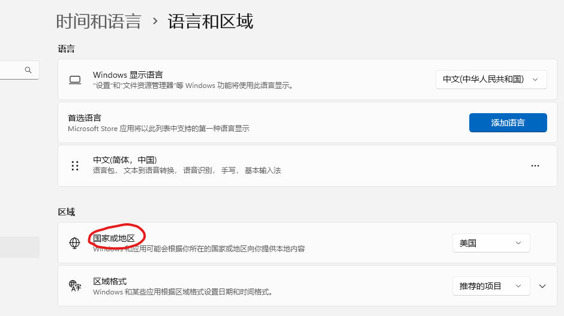
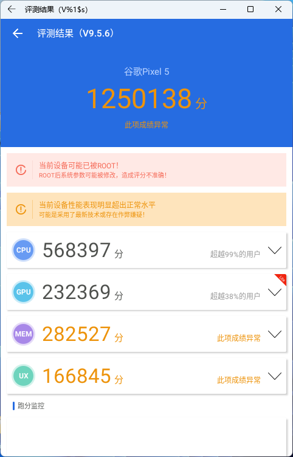

按：lz寒假得一新机，抵不住这些新技术的诱惑，便去折腾一番，顺便记录下一些坑点

#### 写在前面

+ lz是个爱折腾的人,装这些主要是尝个鲜，以体验为目的；至于能否真的成为生产力，还需进一步的测试及深入使用
  
+ 如有谬误，欢迎指出；欢迎大家补充一些细节；lz不是计院的，不太了解这些技术的底层实现原理
+ 文中结论大多是主观感受，不一定对，请谨慎参考
+ 每个人的机子软硬件情况不同，未必都能成功安装，具体运行情况也可能大相径庭
+ 以下一些步骤可能需要科学上网；若电脑的硬盘空间和内存不足，请小心尝试
+ lz电脑（台式）大致配置：Win 11 22H2，Intel i7 13700K，内存32GB（D5），一块N卡，1TB SSD
+ 第一次写此类文章，经验不足，写得不好请见谅
# PART I WSL：Windows Subsystem for Linux
### 安装动机：
上了@王重阳的数学软件和数据结构，从此入了Linux的坑。使用Linux的途径主要有以下几个，但都有一些不尽人意之处： 
1. 虚拟机：lz当时用的是Ubuntu+VMware Workstation，总体体验良好，快照也十分方便。（但总觉得虚拟机作为学习和开发环境不太稳？）当时遇到的问题是VM tools死活装不上，为了方便地和主机互传文件，最后只能在Ubuntu内搭建了个vsftpd服务。
2. Win+Linux双系统：直接装在物理机上感觉比较稳，但毕竟主要的资料都已经放在了Win上，还是不太方便。一些驱动可能会有问题，比如lz当时装的Ubuntu无法联网。
3. docker：不了解。
4. 云服务器：要付钱。

### WSL是什么
Windows Subsystem for Linux（简称WSL）是一个在Windows 10\11上能够运行原生Linux二进制可执行文件（ELF格式）的兼容层。WSL 2 是它的一个新版本，在托管 VM 内使用实际的 Linux 内核、支持完整的系统调用兼容性以及跨 Linux 和 Windows 操作系统的性能。（来自百度百科，不一定准确。更详细可以看[这个](https://devblogs.microsoft.com/commandline/learn-about-windows-console-and-windows-subsystem-for-linux-wsl/)）
### 优点(微软自称)
开发人员可以在 Windows 计算机上同时访问 Windows 和 Linux 的强大功能。 通过WSL，开发人员可以安装 Linux 发行版（例如 Ubuntu、OpenSUSE、Kali、Debian、Arch Linux 等），并直接在 Windows 上使用 Linux 应用程序、实用程序和 Bash 命令行工具，不用进行任何修改，也无需承担传统虚拟机或双启动设置的费用。
### 安装过程
lz直接按[官方教程](https://learn.microsoft.com/zh-cn/windows/wsl/install)进行安装，没有遇到什么问题。有些平台可能要手动开启虚拟化等功能。这方面网上的教程很多，不再赘述。  
> 注：WSL有1和2两个版本，我装的是默认的WSL 2，区别可见[这里](https://learn.microsoft.com/zh-cn/windows/wsl/compare-versions)。
### 使用与测试
安装完成之后，我继续按[官方文档](https://learn.microsoft.com/zh-cn/windows/wsl/setup/environment)进行了相关设置。注意，你仅会得到一个命令行工具，并没有Ubuntu的图形界面。

WSL的文件系统可以直接在本地访问：

VScode安装了远程开发扩展包后，可以直接使用 WSL 作为开发环境，使用Linux下的工具链。

> 注：只测试了VScode和Aanaconda，其他开发工具是否适用未知。lz申到JetBrains的教育套餐后转战CLion，没有进一步使用这套工具，不清楚能否真的大幅提高开发效率。  
### 个人评价
1. 总体体验不错，挺流畅的，且安装成本小。
2. 对新手可能不太友好，因为缺乏图形界面。
# PART II WSA:Windows Subsystem for Android
### 安装动机：
1. 手机上有些应用（比如TIDE，小睡眠）lz喜欢得不得了，想直接安装在电脑上；现在安卓上的应用和游戏越来越大，都几个G起步，lz手机不太放得下了，想转移一些到PC上。
2. 为何不用传统的安卓模拟器：现在市面上各种安卓模拟器可谓汗牛充栋（这个成语可能用得不太对，意思大概如此），但就lz的使用体验来看，这些模拟器大多性能释放不佳，且内置的安卓系统版本较低，有时会有兼容性问题。
### WSA是什么
"适用于 Android™️ 的 Windows 子系统",功能与传统的安卓模拟器类似，但貌似底层的实现原理不同。
### 安装过程
我是按照[官方文档](https://learn.microsoft.com/zh-cn/windows/android/wsa/)直接在微软应用商店装了Amazon Appstore，然后WSA就有了，没有碰到什么问题。注意，如果要用这个方法安装，需要先改一下地区：

如果行不通，可以上知乎或B站搜一下最新的安装教程。
> 注：WSA本身不带有谷歌框架，如果想要直接安装带有谷歌框架的版本，需要借助[MagiskOnWSALocal](https://github.com/LSPosed/MagiskOnWSALocal)来手动构建WSA安装包。图文教程可看这两篇：[win11 安卓子系统（WSA）ROOT安装面具（Magisk）与谷歌框架（Google Apps）](https://www.tjsky.net/tutorial/384);[一日一技 | WSA 定制安装，找回你需要的 Google 服务和 Magisk](https://sspai.com/post/75351#!)。lz直接按照GitHub项目主页上的指导进行构建，运行环境为WSL2。遇到的坑点是那个脚本无法下载一些所需的包，最后lz只能研究了下源码然后手动下载了那些包进行离线构建。实测这样的方法确实可行：
### 安装之后
1.可以安装一下这个工具:[WSA 工具箱(WSA ToolBox)](https://apps.microsoft.com/store/detail/wsa%E5%B7%A5%E5%85%B7%E7%AE%B1/9PPSP2MKVTGT?hl=zh-cn&gl=cn)。此工具十分强大，可直接用它来安装APK等。

2.可以安装一些国内的应用市场，比如小米、华为的应用商店，酷安等。
> 注：若APP需要访问外网，则还需**在WSA内**安装科学上网工具
### 使用与测试
首先是安兔兔跑分：

应用和游戏测了一些，比如Zlib手机版，小睡眠，COC，地铁跑酷，jetpack joyride。除了COC(在Play Store里下的)进不去，其他运行都没啥问题。

>注：WSA现在支持一些用键盘作为触控输入的功能，但估计和市面上一些安卓模拟器的键位设置工具还是有差距。
### 个人评价
1. WSA的性能释放还是可以的，至少CPU是如此；至于对各类APP的兼容性，还有待进一步测试。
2. 实际用途：可以装一些只有手机客户端的软件。WSA与Windows的融合度比较好，APP可直接从Win的开始菜单启动，启动速度挺快，lz总体体验不错。
3. 至于能否提高Android应用的开发效率，由于lz不是干这一行的，不太清楚。
# PART III macOS on VMware Workstation  
### 安装动机
1. lz久闻macOS乃开发利器，感觉美丽国大学师生人手一台，心向往之，便想体验一波；奈何没有换机的机会，只好另寻他法，鸟枪作炮。
2. 为何用选择虚拟机而不是黑苹果双系统：黑苹果若不是特定配置的电脑不一定能成功，且各种设置比较复杂；虚拟机安装成本低，对原系统影响较小。
### 安装原理
>VMware Workstation是VMware公司推出的一款跨平台虚拟机软件，它支持虚拟Windows和Linux系统。事实上，VMware Workstation也可以虚拟macOS，但由于苹果的限制，VMware 公司承诺: 只有在苹果产品上的VMware Workstation，才可以创建 macOS 虚拟机。如果不是苹果的硬件，那么VMware Workstation创建选项中是找不到macOS系统的。但实际情况是可以用一些工具（比如有名的 Unlocker）来突破这一限制，这样用户就可以创建macOS虚拟机了。
### 安装过程
警告:实测安装这样的一台虚拟机会占用30-40G的硬盘空间。
> 注：关于macOS版本的选择。lz尝试安装过10.12，10.14，11.6，12.5，13.0这几个版本，只有12.5没有安装成功。建议直接安装最新的macOS 13 Ventura，因为11以上的UI会更美观，虽然某些动画效果会有明显的卡顿，但总体影响不大。若不行，可试下macOS Mojave 10.14，lz测试这个版本总体挺流畅，且软件兼容性也尚可。

macOS系统镜像可以到[这个网站](https://sysin.org/blog/macOS/)下载，其中13.2的下载地址在[这里](https://pan.baidu.com/s/1jy76a3LYA_PB9hCOOMniYg?pwd=1699)。
图文教程可以看以下几个：
[windows如何装Xcode？（包含windows装mac os）](https://zhuanlan.zhihu.com/p/594268411)
[全网最详细的VMware虚拟机安装MacOS系统教程，没有之一！！！附全部资源](https://zhuanlan.zhihu.com/p/337036027)
[VMware WorkStation Pro 16安装MacOS12，13手把手图文教程（全流程详细图解）](http://www.360doc.com/content/22/1101/13/80545406_1054142056.shtml)
lz用了上面第一个教程里的VMware Workstation和Unlocker,将安装过程中遇到的一些坑点记录如下：
+ 安装过程中收到类似于“应用程序副本已损坏，不能用来安装macOS”的提示：看[这篇教程](https://sysin.org/blog/macos-installer-damaged/) 离线修改日期即可。如果之后卡住，再联网就可以继续安装。

+ 若卡顿，除了上面这些教程里提到的优化方法，也可以尝试通过减小分辨率来缓解；还可以给虚拟机分配更多的内存和CPU核心来提高表现（系统内的“活动监视器”里可以查看资源的占用情况）。  
  > 注：虚拟机的硬件配置可以在关机后直接在软件内修改，无需再新建
+ 如果安装了macOS 13 Ventura后无法联网，看[这篇教程](https://sysin.org/blog/macos-installer-damaged/)修改 .vmx配置文件即可。
+ lz发现如果用了EasyConnect连rvpn，虚拟机会上不了网，关掉之后就好了。

一般来说，虚拟机的网络设置用默认的（NAT）不会有啥问题。系统安装完成之后，建议装下VMWare Tools（具有开启全屏显示、文件拖拽等功能），教程可看以下两篇。
[How to Quickly Install VMWare Tools on macOS Ventura?](https://intozoom.com/how-to-quickly-install-vmware-tool-on-macos-ventura/#more-3978)
[How to Enable drag and drop between macOS Ventura on VMWare and Windows host?](https://intozoom.com/enable-drag-and-drop-between-macos-ventura-and-windows/#more-4005)
### 使用与测试
实际使用感觉并没有网上说的那么卡，至少在10.14下这个经典的窗口缩放动画还是挺流畅的

开发工具：vscode试过，不行；倒是PyCharm运行没啥问题；独占的Xcode未尝试。顺便体验了下被人吹爆的macOS终端，iTerm2+Oh My Zsh+流行的Powerlevel10k皮肤：

其他软件：Safari和iTunes可用，此外还体验了款小游戏：Mini Metro，可以运行。

> 注：这是在[精品MAC应用分享](https://xclient.info/)这个网站下的。
### 个人评价
1. 在虚拟机内查看系统信息，显存（VRAM）均显示为128MB，估计这就是有时卡顿的原因。
2. 若想体验一下macOS，应该会比装黑苹果双系统方便,可以一试。
#### 文末彩蛋：番外篇 我接触过的那些主机模拟器（Nintendo）
+ [Cemu](http://cemu.info/):Wii U 模拟器，lz用它来玩《塞尔达传说：荒野之息》，流畅（运行配置是一台Ryzen 7 5800U+核显的轻薄本，外加一只莱仕达9607X手柄）。
  
    > 野炊发布于2017年，掀起了开放世界的热潮，lz认为至今仍十分值得体验；相比于原神，lz认为野炊更精致一些，但内容应该不及前者丰富（都玩过，个人主观感受）；想要体验的话，百度cemu贴吧有许多资源，比如[这个](https://tieba.baidu.com/p/7339372495)。
 + [yuzu](https://yuzu-emu.org/):Switch 模拟器，lz在上面试过Super Mario Odyssey和P5R，流畅。相关资源可自行搜索。