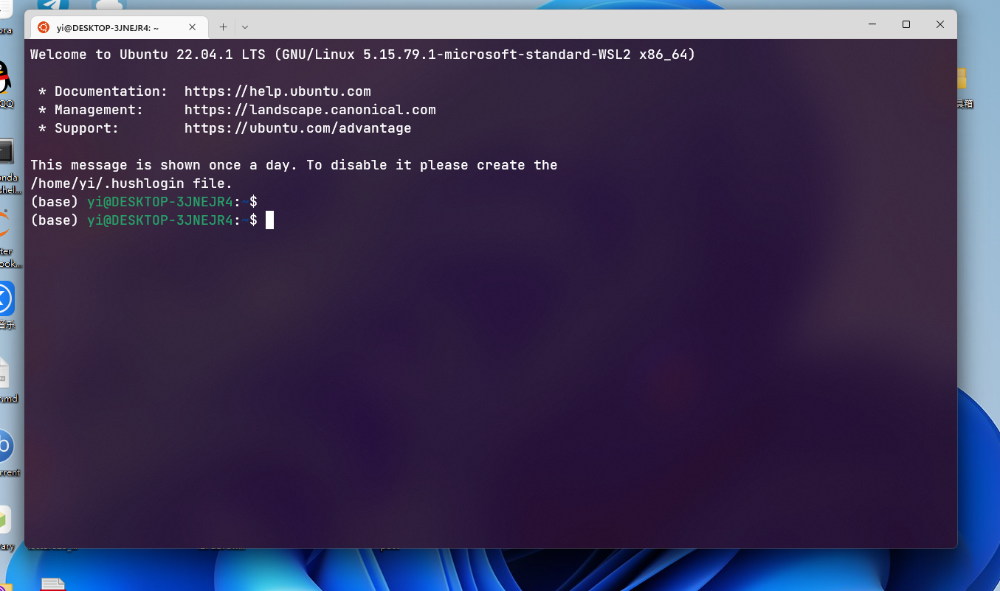

# PART I WSL：Windows Subsystem for Linux
### 安装动机：
上了@王重阳的数学软件和数据结构，从此入了Linux的坑。使用Linux的途径主要有以下几个，但都有一些不尽人意之处： 
1. 虚拟机：lz当时用的是Ubuntu+VMware Workstation，总体体验良好，快照也十分方便。（但总觉得虚拟机作为学习和开发环境不太稳？）当时遇到的问题是VM tools死活装不上，为了方便地和主机互传文件，最后只能在Ubuntu内搭建了个vsftpd服务。
2. Win+Linux双系统：直接装在物理机上感觉比较稳，但毕竟主要的资料都已经放在了Win上，还是不太方便。一些驱动可能会有问题，比如lz当时装的Ubuntu无法联网。
3. docker：不了解。
4. 云服务器：要付钱。

### WSL是什么
Windows Subsystem for Linux（简称WSL）是一个在Windows 10\11上能够运行原生Linux二进制可执行文件（ELF格式）的兼容层。WSL 2 是它的一个新版本，在托管 VM 内使用实际的 Linux 内核、支持完整的系统调用兼容性以及跨 Linux 和 Windows 操作系统的性能。（来自百度百科，不一定准确。更详细可以看[这个](https://devblogs.microsoft.com/commandline/learn-about-windows-console-and-windows-subsystem-for-linux-wsl/)）
### 优点(微软自称)
开发人员可以在 Windows 计算机上同时访问 Windows 和 Linux 的强大功能。 通过WSL，开发人员可以安装 Linux 发行版（例如 Ubuntu、OpenSUSE、Kali、Debian、Arch Linux 等），并直接在 Windows 上使用 Linux 应用程序、实用程序和 Bash 命令行工具，不用进行任何修改，也无需承担传统虚拟机或双启动设置的费用。
### 安装过程
lz直接按[官方教程](https://learn.microsoft.com/zh-cn/windows/wsl/install)进行安装，没有遇到什么问题。有些平台可能要手动开启虚拟化等功能。这方面网上的教程很多，不再赘述。  
> 注：WSL有1和2两个版本，我装的是默认的WSL 2，区别可见[这里](https://learn.microsoft.com/zh-cn/windows/wsl/compare-versions)。
### 使用与测试
安装完成之后，我继续按[官方文档](https://learn.microsoft.com/zh-cn/windows/wsl/setup/environment)进行了相关设置。注意，你仅会得到一个命令行工具，并没有Ubuntu的图形界面。

WSL的文件系统可以直接在本地访问：

VScode安装了远程开发扩展包后，可以直接使用 WSL 作为开发环境，使用Linux下的工具链。

> 注：只测试了VScode和Aanaconda，其他开发工具是否适用未知。lz申到JetBrains的教育套餐后转战CLion，没有进一步使用这套工具，不清楚能否真的大幅提高开发效率。  
### 个人评价
1. 总体体验不错，挺流畅的，且安装成本小。
2. 对新手可能不太友好，因为缺乏图形界面。
