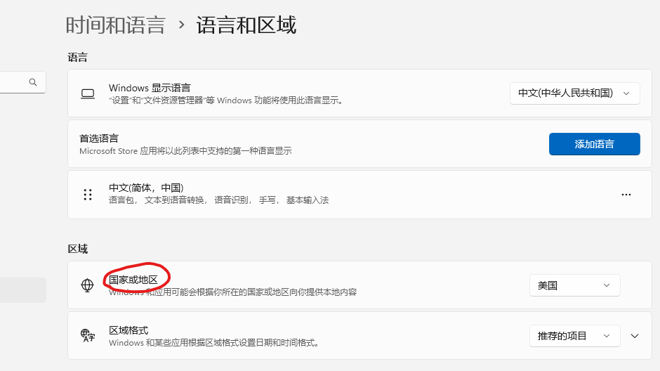
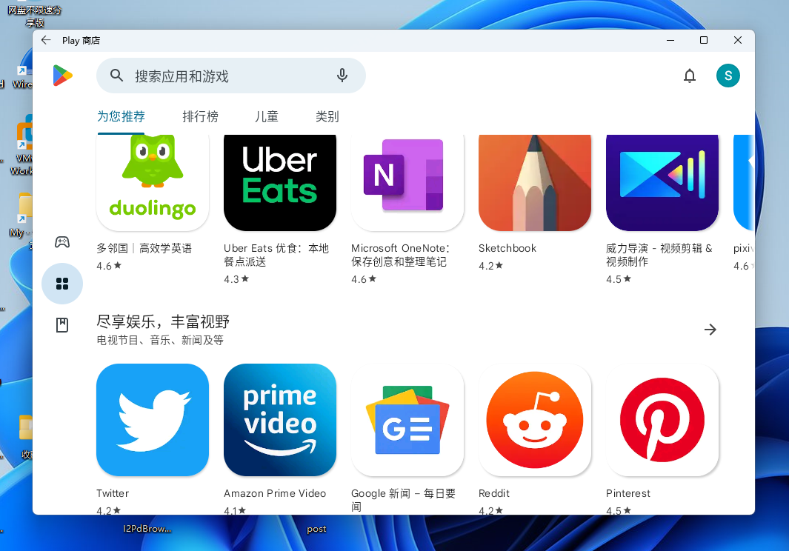
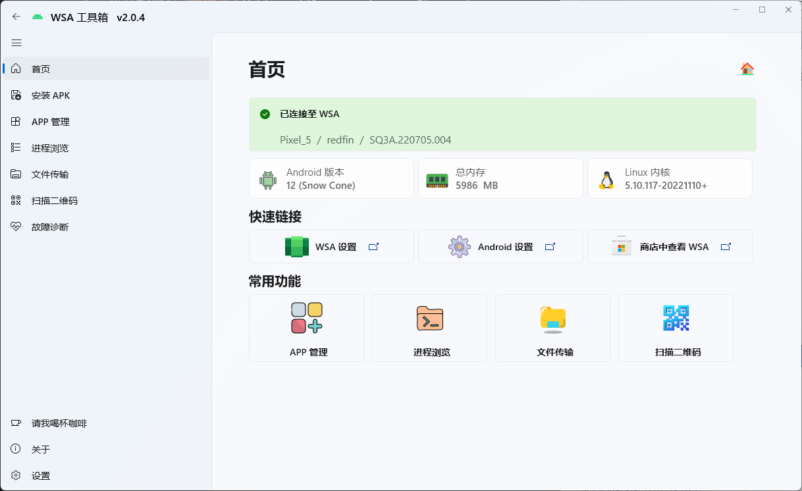
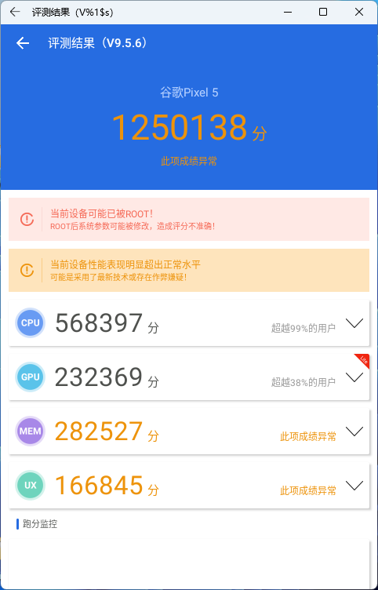

# PART II WSA:Windows Subsystem for Android
### 安装动机：
1. 手机上有些应用（比如TIDE，小睡眠）lz喜欢得不得了，想直接安装在电脑上；现在安卓上的应用和游戏越来越大，都几个G起步，lz手机不太放得下了，想转移一些到PC上。
2. 为何不用传统的安卓模拟器：现在市面上各种安卓模拟器可谓汗牛充栋（这个成语可能用得不太对，意思大概如此），但就lz的使用体验来看，这些模拟器大多性能释放不佳，且内置的安卓系统版本较低，有时会有兼容性问题。
### WSA是什么
"适用于 Android™️ 的 Windows 子系统",功能与传统的安卓模拟器类似，但貌似底层的实现原理不同。
### 安装过程
我是按照[官方文档](https://learn.microsoft.com/zh-cn/windows/android/wsa/)直接在微软应用商店装了Amazon Appstore，然后WSA就有了，没有碰到什么问题。注意，如果要用这个方法安装，需要先改一下地区：

如果行不通，可以上知乎或B站搜一下最新的安装教程。
> 注：WSA本身不带有谷歌框架，如果想要直接安装带有谷歌框架的版本，需要借助[MagiskOnWSALocal](https://github.com/LSPosed/MagiskOnWSALocal)来手动构建WSA安装包。图文教程可看这两篇：[win11 安卓子系统（WSA）ROOT安装面具（Magisk）与谷歌框架（Google Apps）](https://www.tjsky.net/tutorial/384);[一日一技 | WSA 定制安装，找回你需要的 Google 服务和 Magisk](https://sspai.com/post/75351#!)。lz直接按照GitHub项目主页上的指导进行构建，运行环境为WSL2。遇到的坑点是那个脚本无法下载一些所需的包，最后lz只能研究了下源码然后手动下载了那些包进行离线构建。实测这样的方法确实可行：
### 安装之后
1.可以安装一下这个工具:[WSA 工具箱(WSA ToolBox)](https://apps.microsoft.com/store/detail/wsa%E5%B7%A5%E5%85%B7%E7%AE%B1/9PPSP2MKVTGT?hl=zh-cn&gl=cn)。此工具十分强大，可直接用它来安装APK等。

2.可以安装一些国内的应用市场，比如小米、华为的应用商店，酷安等。
> 注：若APP需要访问外网，则还需**在WSA内**安装科学上网工具
### 使用与测试
首先是安兔兔跑分：

应用和游戏测了一些，比如Zlib手机版，小睡眠，COC，地铁跑酷，jetpack joyride。除了COC(在Play Store里下的)进不去，其他运行都没啥问题

>注：WSA现在支持一些用键盘作为触控输入的功能，但估计和市面上一些安卓模拟器的键位设置工具还是有差距。
### 个人评价
1. WSA的性能释放还是可以的，至少CPU是如此；至于对各类APP的兼容性，还有待进一步测试。
2. 实际用途：可以装一些只有手机客户端的软件。WSA与Windows的融合度比较好，APP可直接从Win的开始菜单启动，启动速度挺快，lz总体体验不错。
3. 至于能否提高Android应用的开发效率，由于lz不是干这一行的，不太清楚。
