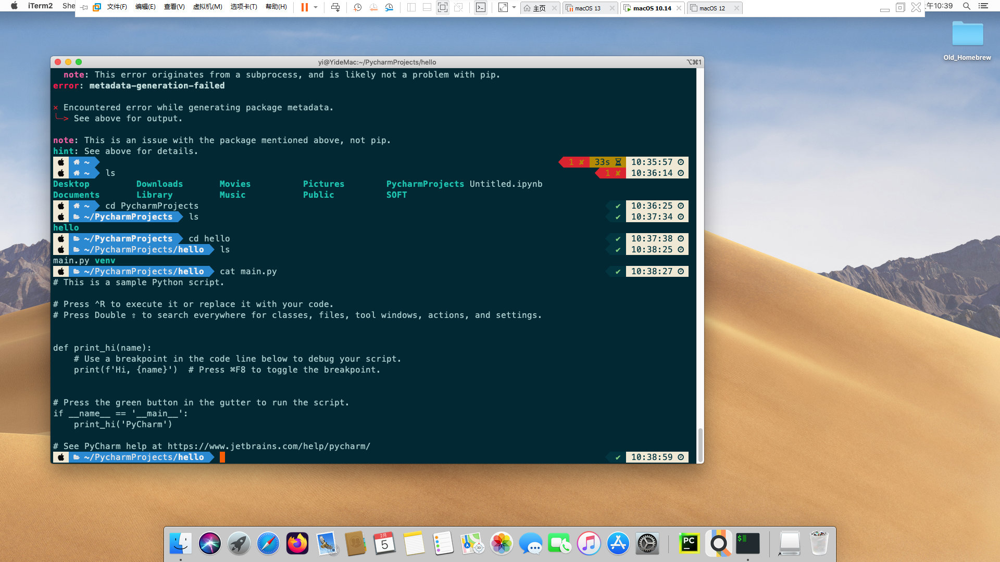

# PART III macOS on VMware Workstation  
### 安装动机
1. lz久闻macOS乃开发利器，感觉美丽国大学师生人手一台，心向往之，便想体验一波；奈何没有换机的机会，只好另寻他法，鸟枪作炮。
2. 为何用选择虚拟机而不是黑苹果双系统：黑苹果若不是特定配置的电脑不一定能成功，且各种设置比较复杂；虚拟机安装成本低，对原系统影响较小。
### 安装原理
>VMware Workstation是VMware公司推出的一款跨平台虚拟机软件，它支持虚拟Windows和Linux系统。事实上，VMware Workstation也可以虚拟macOS，但由于苹果的限制，VMware 公司承诺: 只有在苹果产品上的VMware Workstation，才可以创建 macOS 虚拟机。如果不是苹果的硬件，那么VMware Workstation创建选项中是找不到macOS系统的。但实际情况是可以用一些工具（比如有名的 Unlocker）来突破这一限制，这样用户就可以创建macOS虚拟机了。
### 安装过程
警告:实测安装这样的一台虚拟机会占用30-40G的硬盘空间。
> 注：关于macOS版本的选择。lz尝试安装过10.12，10.14，11.6，12.5，13.0这几个版本，只有12.5没有安装成功。建议直接安装最新的macOS 13 Ventura，因为11以上的UI会更美观，虽然某些动画效果会有明显的卡顿，但总体影响不大。若不行，可试下macOS Mojave 10.14，lz测试这个版本总体挺流畅，且软件兼容性也尚可。

macOS系统镜像可以到[这个网站](https://sysin.org/blog/macOS/)下载，其中13.2的下载地址在[这里](https://pan.baidu.com/s/1jy76a3LYA_PB9hCOOMniYg?pwd=1699)。
图文教程可以看以下几个：
[windows如何装Xcode？（包含windows装mac os）](https://zhuanlan.zhihu.com/p/594268411)
[全网最详细的VMware虚拟机安装MacOS系统教程，没有之一！！！附全部资源](https://zhuanlan.zhihu.com/p/337036027)
[VMware WorkStation Pro 16安装MacOS12，13手把手图文教程（全流程详细图解）](http://www.360doc.com/content/22/1101/13/80545406_1054142056.shtml)
lz用了上面第一个教程里的VMware Workstation和Unlocker,将安装过程中遇到的一些坑点记录如下：
+ 安装过程中收到类似于“应用程序副本已损坏，不能用来安装macOS”的提示：看[这篇教程](https://sysin.org/blog/macos-installer-damaged/) 离线修改日期即可。如果之后卡住，再联网就可以继续安装。

+ 若卡顿，除了上面这些教程里提到的优化方法，也可以尝试通过减小分辨率来缓解；还可以给虚拟机分配更多的内存和CPU核心来提高表现（系统内的“活动监视器”里可以查看资源的占用情况）。  
  > 注：虚拟机的硬件配置可以在关机后直接在软件内修改，无需再新建
+ 如果安装了macOS 13 Ventura后无法联网，看[这篇教程](https://sysin.org/blog/macos-installer-damaged/)修改 .vmx配置文件即可。
+ lz发现如果用了EasyConnect连rvpn，虚拟机会上不了网，关掉之后就好了。

一般来说，虚拟机的网络设置用默认的（NAT）不会有啥问题。系统安装完成之后，建议装下VMWare Tools（具有开启全屏显示、文件拖拽等功能），教程可看以下两篇。
[How to Quickly Install VMWare Tools on macOS Ventura?](https://intozoom.com/how-to-quickly-install-vmware-tool-on-macos-ventura/#more-3978)
[How to Enable drag and drop between macOS Ventura on VMWare and Windows host?](https://intozoom.com/enable-drag-and-drop-between-macos-ventura-and-windows/#more-4005)
### 使用与测试
实际使用感觉并没有网上说的那么卡，至少在10.14下这个经典的窗口缩放动画还是挺流畅的

开发工具：vscode试过，不行；倒是PyCharm运行没啥问题；独占的Xcode未尝试。顺便体验了下被人吹爆的macOS终端，iTerm2+Oh My Zsh+流行的Powerlevel10k皮肤：

其他软件：Safari和iTunes可用，此外还体验了款小游戏：Mini Metro，可以运行。

> 注：这是在[精品MAC应用分享](https://xclient.info/)这个网站下的。
### 个人评价
1. 在虚拟机内查看系统信息，显存（VRAM）均显示为128MB，估计这就是有时卡顿的原因。
2. 若想体验一下macOS，应该会比装黑苹果双系统方便,可以一试。